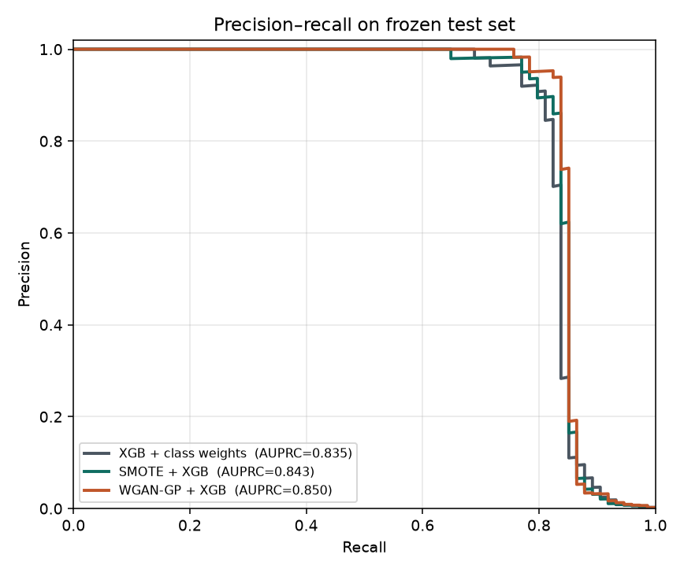
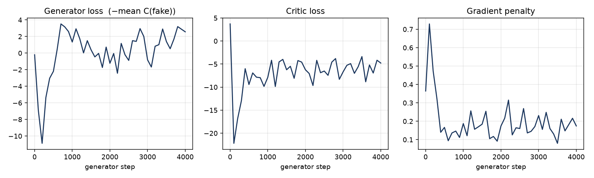
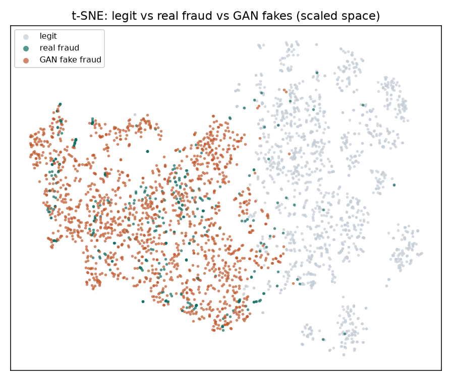

# GAN-augmented credit-card fraud detection

TensorFlow **WGAN-GP** that prints extra fraud rows, then **XGBoost** that actually scores transactions.

Fraud is 492 / 284,807 rows (**0.172%**). A model that always says “not fraud” is 99.83% accurate and catches nobody. The GAN is not the detector. It is a fake-fraud factory used only at training time.

```
CSV  →  stratified split  →  WGAN-GP on train fraud only  →  mix real+fake
                                                      ↘
                                        XGBoost  →  threshold on val  →  test once
```

At inference the generator is **not loaded**. Only the scaler and XGBoost run.

## Why WGAN-GP

Vanilla GAN training often dies (flat generator gradients, mode collapse). This repo implements Wasserstein GAN with gradient penalty in TensorFlow:

| piece | what it does |
|---|---|
| Generator `G` | noise `z` → fake transaction row |
| Critic `C` | row → score (not a probability, no sigmoid) |
| Critic loss | `mean(C(fake)) − mean(C(real)) + λ·GP` |
| Generator loss | `−mean(C(fake))`  (raise the critic’s score on fakes) |
| Gradient penalty | mix real and fake, push `‖∇C‖` toward 1 so the critic stays 1-Lipschitz |

`n_critic = 5`, `λ = 10`, Adam with `β1 = 0` (WGAN-GP defaults).

## Leakage protocol

1. Stratified 70 / 15 / 15 split **first**.
2. `StandardScaler` fit on **train only**.
3. GAN trained on **train-set frauds only**.
4. SMOTE / GAN oversampling happen on train only, to the **same** minority count.
5. Decision threshold chosen on **val** (max F1).
6. Test scored **once**, same test set for all three models.

## Three detectors, one XGBoost config

| model | training rows |
|---|---|
| `weighted` | raw train + `scale_pos_weight = n_neg / n_pos` |
| `smote` | SMOTE up to the same minority count |
| `gan` | real train + WGAN-GP fakes |

Primary metric: **AUPRC**. Accuracy is not reported as a win.

## Setup

Python **3.12** (TensorFlow has no 3.14 wheel). Dataset CSV is downloaded on first run (not stored in git).

```bash
git clone https://github.com/JayRider2001/gan-fraud-detection.git
cd gan-fraud-detection
uv python install 3.12
uv venv --python 3.12 .venv
source .venv/bin/activate
uv pip install -r requirements.txt
python run.py all
```

Or with pip: `python3.12 -m venv .venv && source .venv/bin/activate && pip install -r requirements.txt && python run.py all`

Stages if you want them separate:

```bash
python run.py data      # download + split + scale
python run.py gan       # train WGAN-GP, sample fakes
python run.py detect    # three XGBs, plots, metrics.json
python run.py infer --csv path/to/rows.csv
```

Dataset is pulled from TensorFlow’s public mirror of the ULB / Kaggle credit-card set (European cardholders, September 2013). `Time`, `V1`–`V28` (PCA), `Amount`. `Amount` is `log1p`’d then scaled.

## Results

Frozen **test** set (42,722 rows, **74 frauds**). Thresholds chosen on val (max F1), then applied once.

| model | AUPRC | ROC-AUC | precision | recall | F1 | FP | FN |
|---|---|---|---|---|---|---|---|
| XGB + class weights | 0.835 | 0.970 | 0.908 | 0.797 | 0.849 | 6 | 15 |
| SMOTE + XGB | 0.843 | 0.970 | 0.950 | 0.770 | 0.851 | 3 | 17 |
| **WGAN-GP + XGB** | **0.850** | **0.975** | **0.967** | 0.784 | **0.866** | **2** | 16 |

Primary metric is AUPRC. The GAN run is a modest lift, not a miracle: 74 test frauds is a noisy denominator, and on **validation** AUPRC the GAN was not first. We still keep the val-chosen threshold (no test-set fishing).

**Precision–recall (frozen test set)**



**WGAN-GP training**



**Did the forger learn the fraud blob?** t-SNE of legit vs real fraud vs GAN fakes (scaled space). Synthetics overlap real fraud and sit apart from legit.



Generator loss in code is the line from the crash guide:

```python
# src/gan.py  —  G wants C(fake) high; we minimize, so we flip the sign
loss = -tf.reduce_mean(score)
```

## Layout

```
src/config.py           hyperparameters
src/data.py             download, split, scale
src/gan.py              Generator, Critic, gradient_penalty, WGANGP
src/train_gan.py        5 critic steps / 1 generator step
src/generate.py         sample synthetic fraud
src/train_detector.py   weighted / SMOTE / GAN-aug XGBoost
src/evaluate.py         AUPRC, F1 threshold, confusion
src/infer.py            scaler + XGB only
run.py                  CLI
```

## Limitations

- 492 frauds is a thin support for a GAN; fakes can memorize. t-SNE / feature means are the check.
- `V1`–`V28` are PCA — no merchant semantics, weak explainability.
- Two days in 2013, not a production stream. No concept drift.
- If GAN-aug does not beat SMOTE, that is a valid outcome and is reported as a comparison, not a fake SOTA.

## Interview paragraph

Fraud is rare, so a WGAN-GP is trained on train-set frauds to print extra minority rows. The critic scores real vs fake; the generator maximises that score (`loss = −mean(C(fake))`); a gradient penalty keeps the critic 1-Lipschitz. Fakes are mixed into training, XGBoost is fit, a threshold is chosen on validation, and AUPRC is compared against class weights and SMOTE on a frozen test set. The GAN never sees production traffic.
